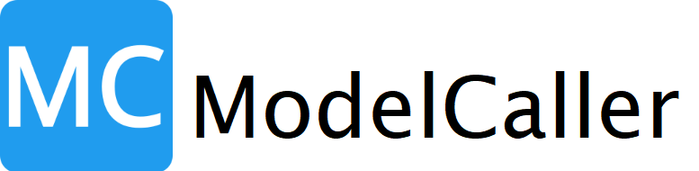

  

# **ModelCaller**: A Python Library for Transforming Predictive and Generative AI Applications
Copyright (C) 2024, Mukesh Dalal. All rights reserved.

ModelCaller facilitates calling, hosting, and registering models and functions with enhanced capabilities like automatic data sensing and caching, training, testing, and capturing supervisory and delayed feedback. It is purposefully designed for predictive and generative AI transformation and continuous improvement of enterprise software.

## Contacts
- Commercial/business inquiries: mc.business@aidaa.ai
- Media/press inquiries: mc.press@aidaa.ai
- Signup for email updates: mc.updates@aidaa.ai
- Feedback: mc.feedback@aidaa.ai
- [Join ModelCaller Discord community](https://discord.gg/CgEvYuNS)
- 
  
## LICENSE:
This software is licensed under a custom license included with this distibution in the file LICENSE.txt, generally based on CC BY-NC-SA (Attribution-NonCommercial-ShareAlike 4.0 International, see https://creativecommons.org/licenses/by-nc-sa/4.0/). This license allows reusers to distribute, remix, adapt, and build upon the material in any medium or format for noncommercial purposes only, and only so long as attribution is given to the creator. If you remix, adapt, or build upon the material, you must license the modified material under identical terms.

Please contact us at mc.business@aidaa.ai for free limited commercial licensing.

**Attribution**:
If you use this software in your work, you must provide proper attribution to the creator using the following suggested format:

*For academic and professional use:*
"Mukesh Dalal. ModelCaller. 2024. Available under a custom license based on CC BY-NC-SA." 

*For software and code attributions:*
"Copyright (c) 2024, Mukesh Dalal. All rights reserved. 
ModelCaller is available under a custom license based on CC BY-NC-SA. It incorporates software components from the Python Standard Library, Requests, Numpy, scikit-learn, and PyTorch under their respective licenses."

**Python Standard Library**:
The Python Standard Library is used under the Python Software Foundation License Version 2.
Copyright (c) 2024, Python Software Foundation; All Rights Reserved
For more details, see https://docs.python.org/3/license.html

**Requests**: HTTP for Humans™
The Requests library is used under the terms of the Apache License 2.0.
Copyright (c) 2024, Kenneth Reitz
For more details, https://github.com/psf/requests?tab=Apache-2.0-1-ov-file

**Numpy**:
Numpy is used under the BSD License.
Copyright (c) 2024, Numpy Developers. All rights reserved.
For more details, see https://numpy.org/doc/stable/license.html

**scikit-learn**:
The scikit-learn components are used under the terms of the BSD 3-Clause License.
Copyright (c) 2024, scikit-learn Developers
For more details, see https://github.com/scikit-learn/scikit-learn/tree/main?tab=BSD-3-Clause-1-ov-file

**PyTorch**:
The PyTorch components are used under the terms of the Modified BSD License.
Copyright (c) 2024, PyTorch Developers
For more details, see https://github.com/pytorch/pytorch/blob/main/LICENSE